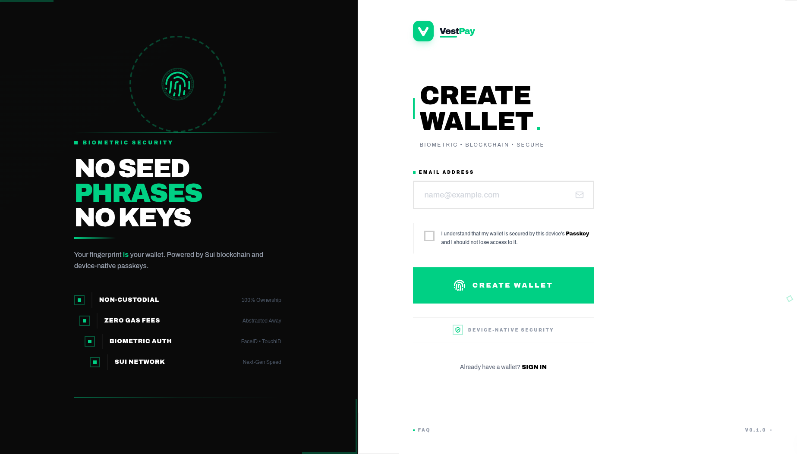

# <p align="center"></p>

# 🚀 VestPay - Premium DeFi Experience on Sui

[](https://nextjs.org/)
[](https://sui.io/)
[](https://www.typescriptlang.org/)
[](https://tailwindcss.com/)

**VestPay** is a state-of-the-art DeFi application built on the **Sui Network**, designed to provide a seamless, secure, and visually stunning experience for managing assets, lending and token swaps. By leveraging **Passkey** technology, VestPay simplifies user authentication while maintaining high-grade security.

---

## ✨ Key Features

- 🌐 **Sui Network Integration**: Native support for Sui assets and smart interactions with mainnet/testnet switching.
- 🔑 **Passkey Authentication**: Secure, biometric, and passwordless login experience using WebAuthn.
- 💰 **Wallet Management**: Send, receive, and manage multiple tokens with real-time balance tracking.
- 🔄 **Multi-DEX Token Swaps**: Aggregated swaps across **Cetus**, **Aftermath**, and **FlowX** DEXs for best rates.
- 💸 **Lending & Borrowing**: Deeply integrated with the **Scallop Protocol** API to provide real-time market data and one-click lending/borrowing.
- 📊 **Intuitive DeFi Dashboard**: A comprehensive overview of your portfolio, active lending pools, and recent activities.
- 📈 **Activity Tracking**: Detailed transaction history and activity logs to keep you informed.
- 🛡️ **Premium UI/UX**: A modern design with smooth animations and a responsive layout.

---

## 🛠️ Technology Stack

### Front-end

- **Framework**: [Next.js 16](https://nextjs.org/) with App Router
- **Styling**: [Tailwind CSS 4](https://tailwindcss.com/) & [Framer Motion](https://www.framer.com/motion/)
- **Icons**: [Lucide React](https://lucide.dev/)
- **State & Logic**: TypeScript, React Hooks, React Server Components
- **Form Validation**: [Zod](https://zod.dev/)

### Blockchain & DeFi

- **Network**: [Sui Network](https://sui.io/) (Mainnet & Testnet)
- **SDK**: `@mysten/sui` (v1.45.2)
- **Lending Protocol**: [Scallop](https://scallop.io/) SDK
- **DEX Aggregators**:
  - [Cetus Protocol](https://cetus.zone/) - Aggregator SDK
  - [Aftermath Finance](https://aftermath.finance/) - TypeScript SDK
  - [FlowX Finance](https://flowx.finance/) - SDK
  - [Suilend](https://suilend.fi/) - SDK for quote aggregation

---

## 📁 Project Structure

```text
vestpay/
├── front-end/                    # Next.js Application
│   ├── app/                      # App Router
│   │   ├── (protect)/           # Protected routes
│   │   │   ├── dashboard/       # Dashboard page
│   │   │   ├── lending/         # Lending page
│   │   │   └── swap/            # Swap page
│   │   ├── login/               # Login page
│   │   └── register/            # Registration page
│   ├── components/              # UI Components
│   │   ├── auth/                # Authentication components
│   │   ├── dashboard/           # Dashboard components
│   │   ├── defi/                # DeFi components
│   │   ├── swap/                # Swap interface components
│   │   ├── wallet/              # Wallet components
│   │   └── ui/                  # Reusable UI components
│   ├── lib/                     # Core libraries
│   │   ├── constants/           # Constants and metadata
│   │   ├── context/             # React contexts
│   │   ├── hooks/               # Custom React hooks
│   │   ├── scallop/             # Scallop Protocol integration
│   │   ├── sui/                 # Sui blockchain utilities
│   │   ├── suilend/             # Suilend SDK integration
│   │   ├── types/               # TypeScript types
│   │   └── utils/               # Utility functions
│   ├── scripts/                 # Utility scripts
│   └── public/                  # Static assets
└── Readme.md                    # Project documentation
```

---

## 🚀 Getting Started

### Prerequisites

- [Node.js](https://nodejs.org/) (v18+)
- [pnpm](https://pnpm.io/) or [npm](https://www.npmjs.com/)

### Installation

1.  **Clone the repository**:

    ```bash
    git clone https://github.com/your-repo/vestpay.git
    cd vestpay
    ```

2.  **Install dependencies and start the development server**:

    ```bash
    cd front-end
    pnpm install
    pnpm dev
    ```

    The application will be available at `http://localhost:3000`

### Environment Setup

The application connects to Sui networks by default. No additional environment variables are required for basic functionality. For production deployments, configure network endpoints as needed.

---

## 📸 Preview

_Placeholder for more screenshots - check out the live demo!_

---

## 🗺️ Roadmap

- [ ] **Multi-chain Support**: Expanding beyond Sui to other L1/L2 networks.
- [ ] **Yield Aggregator**: Automatic shifting of assets to the highest APY pools.
- [ ] **Advanced Swap Features**: Limit orders, multi-hop routing, and price alerts.
- [ ] **Mobile App**: Dedicated iOS and Android versions using React Native.
- [ ] **Staking Integration**: Native staking support for SUI and other tokens.

---

## 📄 License

This project is licensed under the MIT License.

---

<p align="center">Made by VestPay team for the Sui Ecosystem</p>
